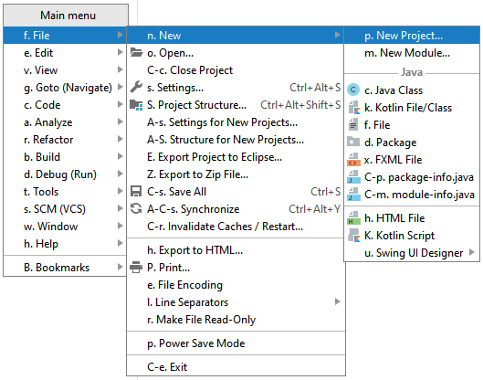
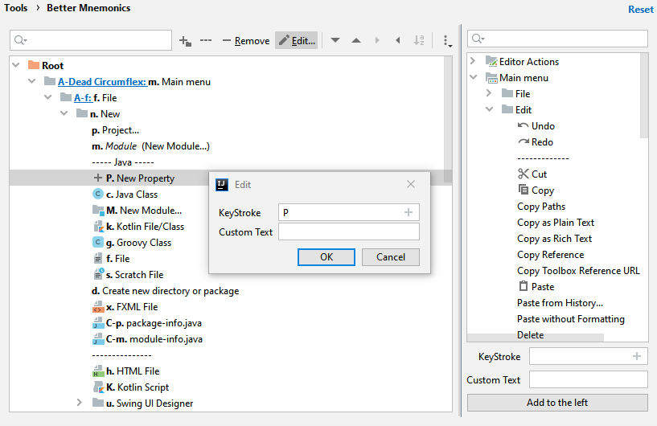

# Better Mnemonics

Adds a fully configurable popup menu to provide better keyboard-only interaction in Jetbrains IDEs. Use your own custom mnemonics instead of hand-contorting shortcuts.

## Screenshots

Explanation of the settings screen:
* The left side is the current configuration.
* The right side shows all the actions that be added to the left.
* the "Mnemonic" for a folder or action can be set freely and are displayed in bold black text before each action in the tree.
* The shortcut text is roughly based on emacs formatting (e.g. A-C-d = Alt-Control-D, A-C-D = Alt-Control-Shift D, A-C-S-F2 = Alt-Control-Shift F2)
* Every folder can be assigned a "Global Shortcut" to open that folder directly as a popup menu. Those are display as bold, blue, underlined text before each folder.
